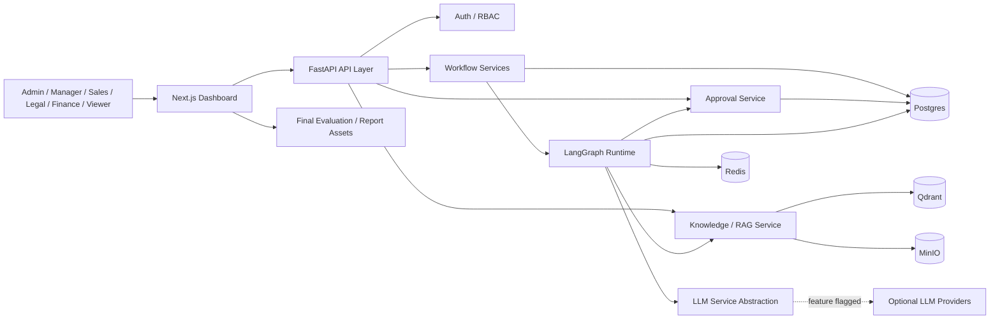

# Multi-Agent System

**Enterprise Multi-Agent OS - Procurement Workflow Automation using a LangGraph-based Multi-Agent System**

Academic title: **Enterprise Procurement Workflow Automation using LangGraph-based Multi-Agent System**

Enterprise Multi-Agent OS is a final graduation-ready workflow orchestration platform for enterprise procurement. It is not a chatbot. It coordinates specialized workflow stages, deterministic services, human approval, RAG evidence, audit events, and deployment-ready operations inside a controlled business process.

## Project Status

- Final graduation-ready project.
- SPEC-001 through SPEC-015 completed and approved.
- Deterministic no-key demo supported by default.
- Optional RAG-enabled demo supported without real LLM keys.
- Real LLM providers are optional and feature-flagged.
- Docker Compose local and production-demo stacks are available.
- Final evaluation, report, demo, diagrams, screenshot checklist, and defense Q&A assets are included.

This repository does not claim real production cloud deployment, Kubernetes, Terraform, secret vault integration, enterprise SSO, production email sending, production OCR, or zero-downtime deployment.

## Overview

Enterprise procurement workflows are slow because they cross Sales, Finance, Legal, and Management responsibilities. They require consistent state transitions, evidence, approvals, and audit records before customer-facing output is safe.

Enterprise Multi-Agent OS automates the workflow without giving control to a free-form chat interface. A workflow is created, run through bounded stages, paused for human approval, and resumed only after an authorized final approval decision.

Implemented workflow path:

```text
Procurement request
  -> planner
  -> retrieval
  -> quotation calculation
  -> compliance
  -> validation / finance-risk review
  -> approval package
  -> WAITING_APPROVAL
  -> human approval
  -> explicit resume
  -> email preview
  -> COMPLETED
```

## Key Features

- FastAPI backend with typed API contracts.
- Next.js dashboard for workflow list, detail, create, run, approval/resume, timeline, evidence, and knowledge search/catalog surfaces.
- JWT authentication and RBAC for Admin, Manager, Sales, Legal, Finance, and Viewer.
- Async SQLAlchemy and Postgres persistence for users, workflows, events, audit evidence, approval state, and runtime state.
- LangGraph workflow runtime with deterministic default behavior.
- `POST /api/v1/workflows/{workflow_id}/run` stops at `WAITING_APPROVAL`.
- `POST /api/v1/workflows/{workflow_id}/resume` continues only after approval.
- Human approval history, audit/event trail, duplicate-final-decision protection, and terminal-state guards.
- Persisted workflow events and WebSocket timeline streaming.
- LLM provider abstraction for fake, Groq, OpenRouter, Ollama, and Gemini providers.
- No-key deterministic mode for reproducible academic evaluation.
- RAG/document knowledge base with deterministic chunking, fake embeddings by default, Qdrant retrieval, and MinIO source object storage.
- Deterministic demo dataset and explicit demo seed CLI.
- Explicit knowledge ingestion CLI for optional RAG evidence demos.
- Docker Compose local development stack and production-demo stack.
- Health, liveness, readiness, structured JSON logs, request IDs, redaction, and protected bounded metrics.
- GitHub Actions CI, local quality gates, and final release quality gate script.
- Final evaluation, report, diagram, screenshot, demo script, release checklist, and defense Q&A assets.

## Architecture



More architecture detail:

- [Report diagram index](docs/report/diagrams/README.md)
- [Architecture and design narrative](docs/report/ARCHITECTURE_AND_DESIGN.md)
- [Project architecture contract](.ai/project/ARCHITECTURE.md)

## Tech Stack

| Area | Stack |
|---|---|
| Backend | Python 3.12, FastAPI, Pydantic v2, async SQLAlchemy, Alembic |
| Runtime | LangGraph |
| Frontend | Next.js, TypeScript, Tailwind CSS, shadcn/ui-compatible component structure |
| Storage | Postgres, Redis, Qdrant, MinIO |
| Auth | JWT, Argon2 password hashing, RBAC |
| LLM | fake, Groq, OpenRouter, Ollama, Gemini |
| RAG | deterministic chunking, fake embeddings by default, Qdrant retrieval, MinIO document storage |
| Observability | structured JSON logs, request IDs, readiness checks, redaction, in-process metrics |
| DevOps | Docker, Docker Compose, GitHub Actions, Bash gate scripts |
| Quality | pytest, Ruff, Black, MyPy, npm lint/build/typecheck/test |

## Repository Structure

```text
.
|-- backend/                    # FastAPI backend, runtime, APIs, services, tests
|-- frontend/                   # Next.js dashboard and frontend tests
|-- docs/demo/                  # Local demo runbook, smoke flow, dataset inventory
|-- docs/deployment/            # Env guide, production-demo runbook, smoke, troubleshooting
|-- docs/final/                 # Final evaluation, demo validation, release checklist
|-- docs/report/                # Graduation report narrative assets
|-- docs/report/diagrams/       # Mermaid architecture diagram sources
|-- docs/llm/                   # LLM provider and no-key local demo docs
|-- scripts/ci/                 # Compose, backend, frontend, and all-gates scripts
|-- scripts/deployment/         # Production-demo smoke script
|-- scripts/final/              # Final E2E and final quality gate scripts
|-- .github/workflows/ci.yml    # Repository CI workflow
|-- .ai/specs/                  # SPEC-001 through SPEC-015 planning assets
|-- docker-compose.yml          # Local development Compose stack
|-- docker-compose.prod.yml     # Production-demo Compose stack
|-- SPEC.md                     # Product specification
|-- AGENTS.md                   # Agent operating guide
```

## Quick Start - Local Deterministic Demo

Clone the renamed repository:

```bash
git clone https://github.com/hzjanuary/multi-agent-system.git
cd multi-agent-system
```

Default no-key mode:

```text
LLM_PROVIDER=fake
LLM_RUNTIME_ENABLED=false
EMBEDDING_PROVIDER=fake
RAG_ENABLED=false
```

Start infrastructure and prepare demo data:

```bash
docker-compose up -d postgres redis qdrant minio
docker-compose run --rm backend-test alembic upgrade head
docker-compose run --rm backend-test python -m app.demo.seed --confirm-local-demo
```

Optional RAG-enabled no-key demo:

```bash
docker-compose run --rm backend-test python -m app.knowledge.ingest_demo --confirm-local-demo
```

Start the backend:

```bash
docker-compose up --build backend
```

Start the frontend in another terminal:

```bash
cd frontend
npm install
npm run dev
```

Open the frontend:

```text
http://localhost:3000
```

Demo credentials and the complete walkthrough are documented in:

- [Demo runbook](docs/demo/DEMO_RUNBOOK.md)
- [Frontend operator guide](docs/demo/FRONTEND_OPERATOR_GUIDE.md)
- [Frontend smoke flow](docs/demo/FRONTEND_SMOKE_FLOW.md)
- [Dataset inventory](docs/demo/DATASET_INVENTORY.md)

Demo credentials are local-demo/board-demo only. Do not reuse them for production.

## Production-Demo Compose

The production-demo stack packages frontend, backend, Postgres, Redis, Qdrant, and MinIO through Docker Compose. It is designed for a board-ready demo deployment path, not a cloud production claim.

Key files:

- Env template: [docs/deployment/.env.production.example](docs/deployment/.env.production.example)
- Compose file: [docker-compose.prod.yml](docker-compose.prod.yml)
- Runbook: [docs/deployment/RUNBOOK.md](docs/deployment/RUNBOOK.md)
- Smoke checks: [docs/deployment/SMOKE_CHECKS.md](docs/deployment/SMOKE_CHECKS.md)
- Troubleshooting: [docs/deployment/TROUBLESHOOTING.md](docs/deployment/TROUBLESHOOTING.md)

Validate and build the production-demo stack:

```bash
docker-compose -f docker-compose.prod.yml --env-file docs/deployment/.env.production.example config
docker-compose -f docker-compose.prod.yml --env-file docs/deployment/.env.production.example build backend frontend
bash scripts/deployment/smoke-prod-demo.sh --help
```

Production-demo limitations are intentional: no Kubernetes, Terraform, cloud deployment automation, secret vault, zero-downtime deployment, production backup automation, or production email sending is included.

## Demo Workflow

The board-demo flow is:

1. Login as Manager/Admin using documented local-demo credentials.
2. Open the workflows dashboard.
3. Open a procurement workflow.
4. Run the workflow.
5. Verify status reaches `WAITING_APPROVAL`.
6. Inspect persisted events and live timeline.
7. Optionally inspect RAG evidence/citations and knowledge search/catalog after enabling RAG and ingesting knowledge docs.
8. Submit approval.
9. View approval history.
10. Resume the workflow.
11. Verify status reaches `COMPLETED`.
12. Optionally check `/ready` and protected metrics.

Demo support docs:

- [Demo runbook](docs/demo/DEMO_RUNBOOK.md)
- [Frontend smoke flow](docs/demo/FRONTEND_SMOKE_FLOW.md)
- [Telegram inbound local demo](docs/demo/TELEGRAM_INBOUND_DEMO.md)
- [Final demo script](docs/final/FINAL_DEMO_SCRIPT.md)
- [Demo timing plan](docs/final/DEMO_TIMING_PLAN.md)
- [Defense Q&A bank](docs/final/DEFENSE_QA_BANK.md)

## API Overview

Implemented endpoint groups:

- Root/service metadata: `GET /`
- Health and operations: `GET /health`, `GET /live`, `GET /ready`
- Auth: login, refresh, logout, current user
- Workflows: create, list, detail, metadata
- Workflow run: `POST /api/v1/workflows/{workflow_id}/run`
- Approval: `POST /api/v1/workflows/{workflow_id}/approval`
- Approval history: `GET /api/v1/workflows/{workflow_id}/approval/history`
- Resume: `POST /api/v1/workflows/{workflow_id}/resume`
- Workflow events: `GET /api/v1/workflows/{workflow_id}/events`
- Workflow event stream: `WS /api/v1/workflows/{workflow_id}/stream`
- Knowledge: document list/detail and search
- Observability: `GET /api/v1/observability/metrics` for Admin/Manager

Deferred endpoint areas:

- approval center routes
- workflow cancellation route
- provider-management/admin key-management UI
- real LLM token streaming endpoints
- upload/admin document management API

## Quality Gates

Run the local quality gates from the repository root:

```bash
bash scripts/ci/compose-gate.sh
bash scripts/ci/backend-gate.sh
bash scripts/ci/frontend-gate.sh
bash scripts/ci/all-gates.sh
bash scripts/final/final-quality-gate.sh
```

Gate behavior:

- Backend gate builds `backend-test`, runs Alembic migration check, pytest, Ruff, Black, MyPy, demo seed dry-run JSON, and knowledge ingestion dry-run JSON.
- Frontend gate runs install, lint, production build, typecheck, and tests serially.
- Final quality gate is non-deploying and non-mutating by default.
- Full mutating E2E validation requires explicit `--confirm-local-demo`.

Final E2E validation script:

```bash
bash scripts/final/e2e-demo-validation.sh --help
bash scripts/final/e2e-demo-validation.sh --confirm-local-demo --include-ready
```

## Final Evaluation And Graduation Assets

Final evidence and submission docs:

- [Final docs index](docs/final/README.md)
- [Evaluation matrix](docs/final/EVALUATION_MATRIX.md)
- [Acceptance evidence plan](docs/final/ACCEPTANCE_EVIDENCE_PLAN.md)
- [E2E demo validation](docs/final/E2E_DEMO_VALIDATION.md)
- [Screenshot checklist](docs/final/SCREENSHOT_CHECKLIST.md)
- [Final demo script](docs/final/FINAL_DEMO_SCRIPT.md)
- [Defense Q&A bank](docs/final/DEFENSE_QA_BANK.md)
- [Release checklist](docs/final/RELEASE_CHECKLIST.md)
- [Final quality gate](docs/final/FINAL_QUALITY_GATE.md)
- [Report assets](docs/report/README.md)
- [Architecture diagrams](docs/report/diagrams/README.md)

## Implementation Status

SPEC-001 through SPEC-015 are completed and approved.

Major completed areas:

- backend foundation
- database foundation
- authentication and RBAC
- storage infrastructure
- workflow state
- LangGraph runtime
- workflow APIs
- event streaming
- frontend dashboard
- demo dataset and seed CLI
- LLM provider abstraction
- human approval and resume
- RAG document knowledge base
- production-demo deployment and observability
- final evaluation, report, demo, diagram, screenshot, release, and Q&A assets

## Safety And Limitations

Safety boundaries:

- Default demo does not require real LLM keys.
- Real LLM providers are optional and feature-flagged.
- Env templates use placeholders; do not commit real secrets.
- Demo credentials are local-demo/board-demo only.
- Do not use real customer data in demo or final evidence.
- Do not expose raw prompts, provider payloads, embeddings, vector payloads, tokens, cookies, API keys, or chain-of-thought.
- Metrics are protected and documented as operational data.
- Demo seed and knowledge ingestion are explicit commands; they do not run on application startup.

Deferred capabilities:

- cloud deployment automation
- Kubernetes/Terraform
- production secret vault
- enterprise SSO
- production email sending
- production OCR/PDF parsing
- upload/admin document management UI
- provider-management UI
- production backup automation
- zero-downtime deployment
- token streaming
- agent-thought streaming
- multi-tenant isolation
- billing/cost dashboard

## Documentation Entry Points

- [Backend README](backend/README.md)
- [Frontend README](frontend/README.md)
- [Scripts README](scripts/README.md)
- [Demo runbook](docs/demo/DEMO_RUNBOOK.md)
- [Deployment docs](docs/deployment/README.md)
- [LLM provider setup](docs/llm/PROVIDER_SETUP.md)
- [Local LLM/no-key demo](docs/llm/LOCAL_LLM_DEMO.md)
- [Ollama local smoke guide](docs/llm/OLLAMA_LOCAL_SMOKE.md)
- [Final release notes](docs/final/FINAL_RELEASE_NOTES.md)
- [Graduation report outline](docs/report/REPORT_OUTLINE.md)

## License

This repository is an academic graduation project.
