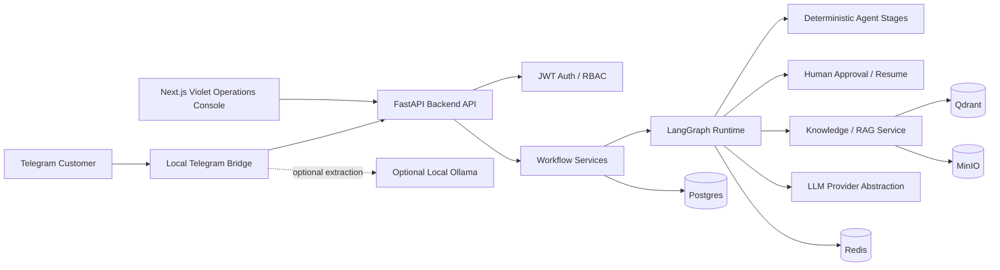

# Multi-Agent System / Enterprise Multi-Agent OS

**Enterprise Procurement Workflow Automation using a LangGraph-based Multi-Agent System**

Multi-Agent System is a graduation-ready enterprise workflow orchestration
project. It is not a chatbot. The application turns procurement requests into
stateful workflows, runs deterministic agent stages, pauses at human approval,
shows bounded operational evidence, and resumes only after an authorized
decision.

## Status

- Final graduation-ready project.
- SPEC-001 through SPEC-015 completed and approved.
- Frontend demo surfaces use the **Violet Operations Console** dark command
  center design.
- Default demo is deterministic and no-key.
- Optional RAG-enabled demo works without real LLM keys.
- Optional local Telegram + Ollama extraction path is available for live
  phone-to-workflow defense demos.
- Docker Compose local and production-demo stacks are available.
- Final evaluation, report, diagram, screenshot, demo script, release, and Q&A
  assets are included.

This repository does not claim cloud production deployment, Kubernetes,
Terraform, enterprise SSO, production secret vault, production OCR, production
email sending, or zero-downtime deployment.

## What It Demonstrates

The defense demo path:

```text
Vietnamese Telegram RFQ
  -> local Telegram bridge
  -> optional Ollama intent extraction
  -> deterministic normalization and catalog safety guard
  -> backend workflow create
  -> deterministic /run
  -> WAITING_APPROVAL
  -> Agent Monitor observation
  -> Manager approval
  -> explicit /resume
  -> COMPLETED with email preview only
```

No final quote, price, stock, delivery promise, auto-approval, auto-resume, or
real email is claimed.

## Key Capabilities

- FastAPI backend with typed APIs.
- Next.js dashboard with dark enterprise operations UI.
- JWT auth and RBAC for Admin, Manager, Sales, Legal, Finance, and Viewer.
- LangGraph workflow runtime with deterministic no-key default behavior.
- `/run` stops at `WAITING_APPROVAL`; `/resume` continues only after approval.
- Human approval history, duplicate-final-decision protection, and audit/event
  trail.
- Agent Monitor for Planner, Retrieval/RAG, Calculator, Compliance,
  Validation/Finance, Approval Package, Human Approval, and Email Preview
  stages.
- Persisted workflow events and WebSocket timeline streaming.
- LLM provider abstraction for fake, Groq, OpenRouter, Ollama, and Gemini.
- Local Telegram inbound bridge with deterministic parser, optional Ollama
  extraction, sales-style replies, Office 365 detection, and unsupported mixed
  item guard.
- RAG/document knowledge base with fake embeddings by default, Qdrant vector
  store, and MinIO object storage.
- Docker Compose local and production-demo stacks.
- Health, liveness, readiness, structured logs, request IDs, redaction, and
  protected bounded metrics.
- CI/local quality gates and final non-mutating quality gate script.
- Final evaluation, report, Mermaid diagrams, screenshot checklist, final demo
  script, and defense Q&A assets.

## Architecture



More detail:

- [Architecture diagrams](docs/report/diagrams/README.md)
- [Architecture and design narrative](docs/report/ARCHITECTURE_AND_DESIGN.md)
- [Project architecture contract](.ai/project/ARCHITECTURE.md)

## Tech Stack

| Area | Stack |
| --- | --- |
| Backend | Python 3.12, FastAPI, Pydantic v2, async SQLAlchemy, Alembic |
| Runtime | LangGraph |
| Frontend | Next.js, React, TypeScript, Tailwind CSS |
| Storage | Postgres, Redis, Qdrant, MinIO |
| Auth | JWT, Argon2, RBAC |
| LLM | fake, Groq, OpenRouter, Ollama, Gemini |
| RAG | deterministic chunking, fake embeddings, Qdrant retrieval, MinIO document storage |
| Observability | structured JSON logs, request IDs, readiness checks, redaction, in-process metrics |
| DevOps | Docker, Docker Compose, GitHub Actions, Bash gate scripts |
| Quality | pytest, Ruff, Black, MyPy, npm lint/build/typecheck/test |

## Repository Structure

```text
backend/                  FastAPI backend, runtime, APIs, services, tests
frontend/                 Next.js operations console and frontend tests
docs/demo/                Demo runbooks, Telegram bridge docs, operator guide
docs/deployment/          Env docs, production-demo runbook, smoke, troubleshooting
docs/final/               Final evaluation, demo validation, release assets
docs/report/              Graduation report narrative assets
docs/report/diagrams/     Mermaid architecture diagram sources
docs/llm/                 Provider setup and local Ollama smoke docs
scripts/ci/               Compose, backend, frontend, and all-gates scripts
scripts/deployment/       Production-demo smoke script
scripts/demo/             Local Telegram and LLM smoke utilities
scripts/final/            E2E validation and final quality gate scripts
.github/workflows/ci.yml  GitHub Actions CI workflow
.ai/specs/                SPEC planning and closeout assets
docker-compose.yml        Local development Compose stack
docker-compose.prod.yml   Production-demo Compose stack
SPEC.md                   Product specification
AGENTS.md                 Agent operating guide
```

## Quick Start - Stable Local Demo

```bash
git clone https://github.com/hzjanuary/multi-agent-system.git
cd multi-agent-system
```

Stable backend mode:

```text
LLM_PROVIDER=fake
LLM_RUNTIME_ENABLED=false
EMBEDDING_PROVIDER=fake
RAG_ENABLED=false
```

Start infrastructure and seed the local demo explicitly:

```bash
docker-compose up -d postgres redis qdrant minio
docker-compose run --rm backend-test alembic upgrade head
docker-compose run --rm backend-test python -m app.demo.seed --confirm-local-demo
docker-compose up --build backend
```

Start the frontend:

```bash
cd frontend
npm install
npm run dev
```

Open:

```text
http://localhost:3000/demo
```

Use the documented local-demo Manager account from
[Frontend operator guide](docs/demo/FRONTEND_OPERATOR_GUIDE.md). Demo
credentials are local-demo/board-demo only.

## Telegram Live Demo

Use this path for the phone-to-system defense demo:

```bash
export TELEGRAM_BOT_TOKEN="<set locally from BotFather>"
export TELEGRAM_LLM_EXTRACTION_ENABLED=true
export TELEGRAM_LLM_BASE_URL=http://localhost:11434
export TELEGRAM_LLM_MODEL=qwen2.5:7b-instruct-q4_K_M
export TELEGRAM_SALES_REPLY_ENABLED=true

python scripts/demo/telegram_inbound_bridge.py --llm-extraction --sales-replies
```

Ollama is used only by the local Telegram bridge for RFQ extraction. The backend
runtime remains deterministic when `LLM_PROVIDER=fake` and
`LLM_RUNTIME_ENABLED=false`.

Primary live demo message:

```text
vay lay truoc cho toi 20 cai laptop tieu chuan kem san office 365
```

Reference docs:

- [Final live demo runbook](docs/demo/FINAL_LIVE_DEMO_RUNBOOK.md)
- [Telegram inbound bridge](docs/demo/TELEGRAM_INBOUND_DEMO.md)
- [Frontend operator guide](docs/demo/FRONTEND_OPERATOR_GUIDE.md)
- [Ollama local smoke guide](docs/llm/OLLAMA_LOCAL_SMOKE.md)

## Production-Demo Compose

The production-demo stack packages frontend, backend, Postgres, Redis, Qdrant,
and MinIO. It is a bounded demo deployment package, not a cloud production
claim.

```bash
docker-compose -f docker-compose.prod.yml --env-file docs/deployment/.env.production.example config
docker-compose -f docker-compose.prod.yml --env-file docs/deployment/.env.production.example build backend frontend
bash scripts/deployment/smoke-prod-demo.sh --help
```

Docs:

- [Deployment README](docs/deployment/README.md)
- [Production-demo runbook](docs/deployment/RUNBOOK.md)
- [Smoke checks](docs/deployment/SMOKE_CHECKS.md)
- [Troubleshooting](docs/deployment/TROUBLESHOOTING.md)

## Demo Workflow In The UI

1. Open `/demo`.
2. Login as Manager.
3. Open Agent Monitor or a seeded workflow.
4. Run a CREATED workflow.
5. Verify `WAITING_APPROVAL`.
6. Inspect Agent Activity and timeline events.
7. Inspect RAG evidence only when RAG is enabled and knowledge was ingested.
8. Approve as Manager/Admin.
9. Resume explicitly.
10. Verify `COMPLETED`.

The frontend never fabricates workflow records, agent activity, events,
evidence, prices, approvals, or final quotes.

## API Overview

Implemented endpoint groups:

- `GET /`, `GET /health`, `GET /live`, `GET /ready`
- Auth login, refresh, logout, current user
- Workflow create, list, detail, run, approval, approval history, resume
- Workflow events and workflow WebSocket stream
- Knowledge document list/detail and search
- Admin/Manager observability metrics

Deferred areas include provider-management UI, cloud deployment automation,
upload/admin document management UI, production email sending, token streaming,
and agent-thought streaming.

## Quality Gates

Run from the repository root:

```bash
bash scripts/ci/compose-gate.sh
bash scripts/ci/backend-gate.sh
bash scripts/ci/frontend-gate.sh
bash scripts/ci/all-gates.sh
bash scripts/final/final-quality-gate.sh
```

Frontend checks:

```bash
cd frontend
npm run lint
npm run build
npm run typecheck
npm test
```

The final quality gate is non-deploying and non-mutating by default. Full E2E
validation requires explicit `--confirm-local-demo`.

## Final Evaluation And Report Assets

- [Final docs index](docs/final/README.md)
- [Evaluation matrix](docs/final/EVALUATION_MATRIX.md)
- [Acceptance evidence plan](docs/final/ACCEPTANCE_EVIDENCE_PLAN.md)
- [E2E demo validation](docs/final/E2E_DEMO_VALIDATION.md)
- [Screenshot checklist](docs/final/SCREENSHOT_CHECKLIST.md)
- [Final demo script](docs/final/FINAL_DEMO_SCRIPT.md)
- [Defense Q&A bank](docs/final/DEFENSE_QA_BANK.md)
- [Release checklist](docs/final/RELEASE_CHECKLIST.md)
- [Final quality gate](docs/final/FINAL_QUALITY_GATE.md)
- [Report assets](docs/report/README.md)

## Safety Boundaries

- Do not commit real secrets, provider keys, Telegram tokens, local `.env`
  files, or `docker-compose.override.yml`.
- Use `docker-compose.override.example.yml` as a safe placeholder template.
- Demo credentials are local-demo/board-demo only.
- Do not use real customer data.
- No final quote is issued before approval.
- No auto-approval or auto-resume.
- No real email is sent.
- No unsupported item is silently dropped by the Telegram bridge.
- No fake price/catalog behavior.
- No raw prompts, provider payloads, embeddings, vector payloads, secrets,
  tokens, cookies, or chain-of-thought are displayed intentionally.

## Roadmap After Defense

1. Conversational Sales Agent and RAG/external reference price research with
   citations: `.ai/specs/SPEC-016-conversational-sales-agent/spec.md`.
2. LLM runtime hardening.
3. Catalog expansion beyond the laptop demo item.
4. Email/Gmail integration for approved final communications.
5. Production deployment polish.

## License

This repository is an academic graduation project.
