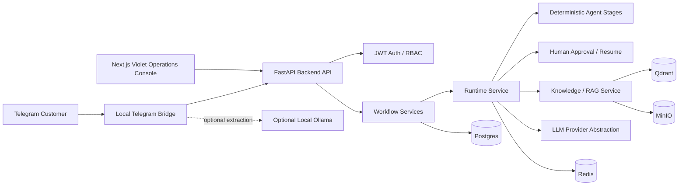

# Enterprise Multi-Agent OS

**Enterprise Procurement Workflow Automation using a LangGraph-based Multi-Agent System**

This project turns procurement requests into stateful workflows, runs
deterministic agent stages, pauses at human approval, shows bounded operational
evidence, and resumes only after an authorized decision. It is not a chatbot.

The stable default demo is offline, deterministic, and requires no API keys.
Optional provider-backed paths exist for real LLM inference (Groq, OpenRouter,
Ollama, Gemini), RAG document grounding, local Telegram RFQ intake, and a
production-demo Compose stack.

## Status

- SPEC-001 through SPEC-025 are Approved / Closed.
- SPEC-026 Production Hardening Sprint 3 is implemented / ready for closeout
  review.
- SPEC-027 Production Automation Planning Sprint 1 is implemented / ready for
  review.
- SPEC-028 LLM Runtime Hardening is **Approved / Closed**. G1-G4 hardening is
  committed and validated; no stable default or safety boundary changed.
- Frontend demo surfaces use the **Violet Operations Console** dark command
  center design.
- Default demo is deterministic and no-key.
- Optional RAG-enabled demo works without real LLM keys.
- Optional local Telegram + Ollama extraction path is available for live
  phone-to-workflow defense demos.
- Docker Compose local and production-demo stacks are available.
- Final evaluation, report, diagram, screenshot, demo script, release, and Q&A
  assets are included.

This repository does not claim cloud production deployment, Kubernetes,
Terraform, enterprise SSO, production secret vault, production OCR, production
email sending, or zero-downtime deployment.

## What It Demonstrates

The defense demo path:

```text
Vietnamese Telegram RFQ
  -> local Telegram bridge
  -> optional Ollama intent extraction
  -> deterministic normalization and catalog safety guard
  -> backend workflow create
  -> deterministic /run
  -> WAITING_APPROVAL
  -> Agent Monitor observation
  -> Manager approval
  -> explicit /resume
  -> COMPLETED with email preview only
```

No final quote, price, stock, delivery promise, auto-approval, auto-resume, or
real email is claimed.

## Runtime And Safety Behavior

The workflow runtime executes bounded stages and records step-level evidence.
Pre-approval stages run on `/run` and stop at `WAITING_APPROVAL`; the single
post-approval stage runs only via explicit `/resume` after an `APPROVED`
decision.

```text
pre-approval:  planner -> retrieval -> quotation -> compliance -> validation -> approval
post-approval: email_preparation
```

- **Deterministic default**: `LLM_PROVIDER=fake`, `LLM_RUNTIME_ENABLED=false`.
  Runtime stages use deterministic node handlers, no provider is called, and no
  API key is required.
- **Optional LLM runtime**: `LLM_RUNTIME_ENABLED=true` routes runtime stages
  through the provider-independent `LLMRuntimeAdapter`. Stages use bounded
  prompt builders, parse structured JSON with Pydantic, and write only
  validated outputs into workflow state. The quotation stage still avoids LLM
  arithmetic and records a deterministic skip marker.
- **Approval boundary**: `/run` always stops at `WAITING_APPROVAL`. `/resume`
  is gated on an `APPROVED` workflow status and a persisted `APPROVE` decision;
  LLM output cannot bypass the approval step. Duplicate final decisions are
  rejected and approval history is persisted.
- **Cancellation (SPEC-028 G1)**: cancelling an in-flight runtime run persists
  a bounded `workflow.runtime.cancelled` event and a safe `CANCELLED` terminal
  state, then re-raises so cancellation semantics are preserved.
- **Fallback transparency (SPEC-028 G3)**: when fallback is enabled, safe stage
  outputs and events record bounded, enum-validated metadata only
  (`llm_fallback_used`, `llm_fallback_from_provider`,
  `llm_fallback_error_category`).
- **Retry and fallback**: retries are bounded by `LLM_MAX_RETRIES` and apply
  only to transient categories (`timeout`, `unavailable`, `rate_limit`).
  Exponential backoff uses a 0.5s base, 2.0 multiplier, 8s cap, and 25% jitter.
  Fallback is disabled by default and never hides missing-key or
  authentication errors.
- **Known limitation (SPEC-028, out of scope)**: the `asyncio.to_thread`
  urllib transport in `backend/app/llm/clients/http.py` is **not
  cancellation-proof**. Cancelling the awaiting task does not stop the
  underlying urllib thread; the thread keeps running until its own `urlopen`
  timeout. This behavior is untested and documented as out of scope. No
  persisted state is produced by that thread.

## Key Capabilities

- FastAPI backend with typed APIs and OpenAPI docs at `/docs`.
- Next.js dashboard with dark enterprise operations UI.
- JWT auth and RBAC for Admin, Manager, Sales, Legal, Finance, and Viewer.
- LangGraph-shaped workflow runtime with deterministic no-key default behavior.
- `/run` stops at `WAITING_APPROVAL`; `/resume` continues only after approval.
- Human approval history, duplicate-final-decision protection, and audit/event
  trail.
- Agent Monitor for Planner, Retrieval/RAG, Calculator, Compliance,
  Validation/Finance, Approval Package, Human Approval, and Email Preview
  stages.
- Persisted workflow events and WebSocket timeline streaming.
- LLM provider abstraction for fake, Groq, OpenRouter, Ollama, and Gemini.
- Local Telegram inbound bridge with deterministic parser, optional Ollama
  extraction, sales-style replies, Office 365 detection, and unsupported mixed
  item guard.
- RAG/document knowledge base with fake embeddings by default, Qdrant vector
  store, and MinIO object storage.
- Docker Compose local and production-demo stacks.
- Health, liveness, readiness, structured logs, request IDs, redaction, and
  protected bounded metrics.
- CI/local quality gates and final non-mutating quality gate script.

## Architecture


```mermaid
flowchart LR
  Telegram[Telegram Customer]
  Bridge[Local Telegram Bridge]
  Frontend[Next.js Violet Operations Console]
  API[FastAPI Backend API]
  Auth[JWT Auth / RBAC]
  Workflow[Workflow Services]
  Runtime[Runtime Service]
  Agents[Deterministic Agent Stages]
  Approval[Human Approval / Resume]
  Knowledge[Knowledge / RAG Service]
  LLM[LLM Provider Abstraction]
  Postgres[(Postgres)]
  Redis[(Redis)]
  Qdrant[(Qdrant)]
  MinIO[(MinIO)]
  Ollama[Optional Local Ollama]

  Telegram --> Bridge
  Bridge --> API
  Frontend --> API
  API --> Auth
  API --> Workflow
  Workflow --> Runtime
  Runtime --> Agents
  Runtime --> Approval
  Runtime --> Knowledge
  Runtime --> LLM
  Bridge -. optional extraction .-> Ollama
  Workflow --> Postgres
  Runtime --> Redis
  Knowledge --> Qdrant
  Knowledge --> MinIO
```

More detail:

- [Architecture diagrams](docs/report/diagrams/README.md)
- [Architecture and design narrative](docs/report/ARCHITECTURE_AND_DESIGN.md)

## Tech Stack

| Area | Stack |
| --- | --- |
| Backend | Python 3.12, FastAPI, Pydantic v2, async SQLAlchemy, Alembic |
| Runtime | LangGraph-shaped deterministic node graph |
| Frontend | Next.js, React, TypeScript, Tailwind CSS |
| Storage | Postgres, Redis, Qdrant, MinIO |
| Auth | JWT, Argon2, RBAC |
| LLM | fake, Groq, OpenRouter, Ollama, Gemini |
| RAG | deterministic chunking, fake embeddings, Qdrant retrieval, MinIO document storage |
| Observability | structured JSON logs, request IDs, readiness checks, redaction, in-process metrics |
| DevOps | Docker, Docker Compose, Bash gate scripts |
| Quality | pytest, Ruff, Black, MyPy, npm lint/build/typecheck/test |

## Repository Structure

```text
backend/                  FastAPI backend, runtime, APIs, services, tests
frontend/                 Next.js operations console and frontend tests
docs/demo/                Demo runbooks, Telegram bridge docs, operator guide
docs/deployment/          Env docs, production-demo runbook, smoke, troubleshooting
docs/evaluation/          SPEC-022 benchmark guide and demo regression checklist
docs/final/               Final evaluation, demo validation, release assets
docs/governance/          Catalog, provider evidence, approval, and outbound policy
docs/llm/                 Provider setup and local Ollama smoke docs
docs/production/          Production hardening checklists and secrets runbook
docs/release/             Final release-readiness package and command checklist
docs/security/            Dependency/security maintenance and triage docs
docs/report/              Graduation report narrative assets
docs/report/diagrams/     Mermaid architecture diagram sources
scripts/ci/               Compose, backend, frontend, and all-gates scripts
scripts/deployment/       Production-demo smoke script
scripts/demo/             Local Telegram and LLM smoke utilities
scripts/final/            E2E validation and final quality gate scripts
scripts/ops/              Environment validation and secret scanning helpers
.ai/specs/                SPEC planning and closeout assets
docker-compose.yml        Local development Compose stack
docker-compose.prod.yml   Production-demo Compose stack
AGENTS.md                 Agent operating guide
```

## Quick Start - Stable Local Demo

> Commands below use the modern `docker compose` v2 plugin. On hosts where the
> legacy `docker-compose` binary is installed, the same commands work with the
> hyphenated form.

```bash
git clone https://github.com/hzjanuary/multi-agent-system.git
cd multi-agent-system
```

Stable backend mode (the Compose stack already sets these):

```text
LLM_PROVIDER=fake
LLM_RUNTIME_ENABLED=false
EMBEDDING_PROVIDER=fake
RAG_ENABLED=false
```

Start infrastructure, migrate, and seed the local demo explicitly:

```bash
docker compose up -d postgres redis qdrant minio
docker compose run --rm backend-test alembic upgrade head
docker compose run --rm backend-test python -m app.demo.seed --confirm-local-demo
docker compose up --build backend
```

Start the frontend:

```bash
cd frontend
npm install
npm run dev
```

Open:

```text
http://localhost:3000/demo
```

Use the documented local-demo accounts from
[Frontend operator guide](docs/demo/FRONTEND_OPERATOR_GUIDE.md) (for example
`manager@example.test` / `DemoPassword123!`). Demo credentials are
local-demo/board-demo only.

The backend service becomes ready when its `/health` check passes; the Docker
image bakes the backend code at build time, so rebuild the `backend` image
after backend source changes (`docker compose up --build backend`).

## Tests And Validation Gates

Run the full backend suite through the `backend-test` service (this uses the
Compose infrastructure services):

```bash
docker compose up -d postgres redis qdrant minio
docker compose run --rm backend-test pytest
```

The `backend-test` image is built from the `dev` target and installs dev
dependencies. Because code is baked into the image, rebuild it after changing
backend code or tests:

```bash
docker compose build backend-test
```

Focused examples:

```bash
docker compose run --rm backend-test pytest app/tests/test_runtime_service.py
docker compose run --rm backend-test pytest app/tests/test_runtime_llm_integration.py
```

Lint, format, and type checks:

```bash
docker compose run --rm backend-test ruff check .
docker compose run --rm backend-test black --check .
docker compose run --rm backend-test mypy app
```

Validate Compose configurations:

```bash
docker compose config
docker compose -f docker-compose.prod.yml --env-file docs/deployment/.env.production.example config
```

Project gate scripts (from the repository root):

```bash
bash scripts/ci/compose-gate.sh    # Validate local and production-demo Compose config
bash scripts/ci/backend-gate.sh    # Build backend-test, migrate, test, lint, typecheck, dry-run seed/ingest
bash scripts/ci/frontend-gate.sh   # Install, lint, build, typecheck, and test frontend serially
bash scripts/ci/all-gates.sh       # All gates plus production-demo app image build and git diff --check
bash scripts/final/final-quality-gate.sh --help
bash scripts/final/final-quality-gate.sh
```

`backend-gate.sh` starts local Compose dependencies but does not remove
volumes. Set `BACKEND_GATE_CLEANUP=1` to stop Compose services after the gate:

```bash
BACKEND_GATE_CLEANUP=1 bash scripts/ci/backend-gate.sh
```

`all-gates.sh` builds the production-demo backend and frontend images, so it
needs a working Docker build environment and network for base image pulls. The
final quality gate is non-deploying and non-mutating by default; use
`--skip-prod-image-build` when only documentation changed.

Frontend checks:

```bash
cd frontend
npm run lint
npm run build
npm run typecheck
npm test
```

Dry-run the demo seed and knowledge ingestion JSON checks:

```bash
docker compose run --rm backend-test python -m app.demo.seed --confirm-local-demo --dry-run --json
docker compose run --rm backend-test python -m app.knowledge.ingest_demo --confirm-local-demo --dry-run --json
```

## Demo Scripts

### Telegram Live Demo

Use this path for the phone-to-system defense demo:

```bash
export TELEGRAM_BOT_TOKEN="<set locally from BotFather>"
export TELEGRAM_LLM_EXTRACTION_ENABLED=true
export TELEGRAM_LLM_BASE_URL=http://localhost:11434
export TELEGRAM_LLM_MODEL=qwen2.5:7b-instruct-q4_K_M
export TELEGRAM_SALES_REPLY_ENABLED=true

python scripts/demo/telegram_inbound_bridge.py --llm-extraction --sales-replies
```

`TELEGRAM_BOT_TOKEN` is required unless using `--dry-run --once` (parse only,
no backend writes). The bridge polls Telegram, parses bounded laptop quotation
requests, creates workflows through existing backend APIs, and can run them to
`WAITING_APPROVAL`. It never auto-approves, auto-resumes, sends real email,
adds backend routes, or requires real LLM providers.

Ollama is used only by the local Telegram bridge for RFQ extraction. The backend
runtime remains deterministic when `LLM_PROVIDER=fake` and
`LLM_RUNTIME_ENABLED=false`.

Primary live demo message:

```text
vay lay truoc cho toi 20 cai laptop tieu chuan kem san office 365
```

Reference docs:

- [Final live demo runbook](docs/demo/FINAL_LIVE_DEMO_RUNBOOK.md)
- [Telegram inbound bridge](docs/demo/TELEGRAM_INBOUND_DEMO.md)
- [Frontend operator guide](docs/demo/FRONTEND_OPERATOR_GUIDE.md)
- [Ollama local smoke guide](docs/llm/OLLAMA_LOCAL_SMOKE.md)

### Ollama LLM Smoke

A local manual utility verifies that a local Ollama server and model can answer
the same non-streaming `/api/chat` shape used by the backend Ollama provider:

```bash
python scripts/demo/llm_provider_smoke.py --help
python scripts/demo/llm_provider_smoke.py --provider ollama --model llama3.1:8b --dry-run
python scripts/demo/llm_provider_smoke.py --provider ollama --model llama3.1:8b --base-url http://localhost:11434
```

The real smoke call requires a running local Ollama server with the model
pulled. It prints only bounded provider/model/status metadata. See
[docs/llm/OLLAMA_LOCAL_SMOKE.md](docs/llm/OLLAMA_LOCAL_SMOKE.md).

### End-To-End Demo Validation

```bash
bash scripts/final/e2e-demo-validation.sh --help
bash scripts/final/e2e-demo-validation.sh --confirm-local-demo --include-ready
bash scripts/final/e2e-demo-validation.sh --confirm-local-demo --include-ready --include-rag
```

The default mode is non-mutating. The full workflow lifecycle requires
`--confirm-local-demo`, never prints tokens or passwords, and uses existing API
endpoints only. RAG validation remains optional via `--include-rag`.

### Production-Demo Compose And Smoke

The production-demo stack packages frontend, backend, Postgres, Redis, Qdrant,
and MinIO. It is a bounded demo deployment package, not a cloud production
claim.

```bash
docker compose -f docker-compose.prod.yml --env-file docs/deployment/.env.production.example config
docker compose -f docker-compose.prod.yml --env-file docs/deployment/.env.production.example build backend frontend
bash scripts/deployment/smoke-prod-demo.sh --help
bash scripts/deployment/smoke-prod-demo.sh --start --include-ready
```

The smoke script checks an already-running stack by default: backend `/health`,
backend `/live`, and the frontend root page without mutating data. Use `--start`
to start the stack first and `--include-ready` to also check backend `/ready`.
The env file is a placeholder template; replace secret placeholders through
deployment environment injection before running a real production-demo stack.

Docs:

- [Deployment README](docs/deployment/README.md)
- [Production-demo runbook](docs/deployment/RUNBOOK.md)
- [Smoke checks](docs/deployment/SMOKE_CHECKS.md)
- [Troubleshooting](docs/deployment/TROUBLESHOOTING.md)

## Demo Workflow In The UI

1. Open `/demo`.
2. Login as Manager (`manager@example.test` / `DemoPassword123!`).
3. Open Agent Monitor or a seeded workflow.
4. Run a CREATED workflow.
5. Verify `WAITING_APPROVAL`.
6. Inspect Agent Activity and timeline events.
7. Inspect RAG evidence only when RAG is enabled and knowledge was ingested.
8. Approve as Manager/Admin.
9. Resume explicitly.
10. Verify `COMPLETED`.

The frontend never fabricates workflow records, agent activity, events,
evidence, prices, approvals, or final quotes.

## LLM Providers

The backend exposes one provider-independent service interface behind five
providers: `fake`, `groq`, `openrouter`, `ollama`, and `gemini`. The safe
default mode is offline and deterministic.

```text
LLM_PROVIDER=fake
LLM_RUNTIME_ENABLED=false
LLM_TIMEOUT_SECONDS=30
LLM_MAX_RETRIES=2
LLM_FALLBACK_ENABLED=false
LLM_FALLBACK_PROVIDER=fake
```

With these defaults no API keys are required, no real provider network calls
are made, the workflow runtime uses the deterministic nodes, the `/run` API
contract is unchanged, and the workflow still stops at `WAITING_APPROVAL`.

To enable a real provider, configure its key and model (for example):

```text
LLM_PROVIDER=groq
GROQ_API_KEY=<local key>
GROQ_MODEL=<model name>
```

`LLM_MODEL` may be used instead of a provider-specific model override; the
provider-specific override wins when both are set. API keys are optional at
application settings load time, and real remote providers fail safely when
selected and used without required configuration.

Full setup, provider error categories, retry/fallback rules, and security notes
are in [docs/llm/PROVIDER_SETUP.md](docs/llm/PROVIDER_SETUP.md).

## API Overview

The backend serves OpenAPI docs at `http://localhost:8000/docs` and ReDoc at
`http://localhost:8000/redoc`. Unprefixed health routes and `/api/v1` business
routes:

```text
GET  /                    Service info
GET  /health              Overall health
GET  /live                Liveness
GET  /ready               Dependency readiness (503 when not ready)

POST /api/v1/auth/login   Login -> token pair
POST /api/v1/auth/refresh Refresh access token
POST /api/v1/auth/logout  Logout
GET  /api/v1/auth/me      Current user

POST /api/v1/workflows                        Create workflow
GET  /api/v1/workflows                        List workflows (limit/offset/status)
GET  /api/v1/workflows/_meta                  Workflow API router metadata
GET  /api/v1/workflows/{workflow_id}          Get workflow
POST /api/v1/workflows/{workflow_id}/run      Run through pre-approval stages
POST /api/v1/workflows/{workflow_id}/approval Submit approval decision
GET  /api/v1/workflows/{workflow_id}/approval/history  Approval history
POST /api/v1/workflows/{workflow_id}/resume   Resume after approval
POST /api/v1/workflows/{workflow_id}/transition       Transition status
PATCH /api/v1/workflows/{workflow_id}/state           Replace state payload
GET  /api/v1/workflows/{workflow_id}/events           List workflow events
GET  /api/v1/workflows/{workflow_id}/outbound/preview Outbound email preview
WS   /api/v1/workflows/{workflow_id}/stream           Event stream (Bearer/query token)

POST /api/v1/knowledge/search                  Search knowledge base
GET  /api/v1/knowledge/documents               List documents
GET  /api/v1/knowledge/documents/{document_id} Get document detail

GET  /api/v1/observability/metrics             In-process metrics (role-gated, when enabled)
```

Access is role-gated. Workflow create requires Admin/Manager/Sales; run,
approval, resume, transition, state update, and outbound preview require
Admin/Manager; reads, events, and knowledge search are available to
Admin/Manager/Sales/Legal/Finance/Viewer. Metrics require Admin/Manager and
`METRICS_ROUTE_ENABLED=true`.

## Configuration Reference

Backend settings are read from environment variables (`.env` file support). The
reference templates are:

- `backend/.env.example` - local-demo backend environment (no-key, deterministic)
- `docs/deployment/.env.ci.example` - CI/test environment
- `docs/deployment/.env.production.example` - production-demo placeholders
- `frontend/.env.example` - browser-visible public frontend values (never secrets)

Key backend variables and defaults:

| Variable | Default | Purpose |
| --- | --- | --- |
| `APP_ENV` | `development` | `development`, `testing`, or `production` |
| `DEBUG` | `true` | Debug mode (Compose backend sets `true`) |
| `API_V1_PREFIX` | `/api/v1` | API prefix |
| `BACKEND_CORS_ORIGINS` | frontend origins | CORS allowlist |
| `LOG_FORMAT` | `json` | Structured log format |
| `LOG_REDACTION_ENABLED` | `true` | Redact sensitive log fields |
| `METRICS_ENABLED` / `METRICS_ROUTE_ENABLED` | `true` | Metrics collection and route |
| `DATABASE_URL` | asyncpg Postgres URL | Postgres connection |
| `REDIS_URL` / `QDRANT_URL` / `MINIO_*` | Compose services | Cache, vector store, object storage |
| `JWT_SECRET_KEY` | local-demo value | JWT signing secret |
| `ACCESS_TOKEN_EXPIRE_MINUTES` | `30` | Access token lifetime |
| `REFRESH_TOKEN_EXPIRE_DAYS` | `7` | Refresh token lifetime |
| `LLM_PROVIDER` | `fake` | Active provider |
| `LLM_RUNTIME_ENABLED` | `false` | Enable LLM runtime adapter |
| `LLM_TIMEOUT_SECONDS` | `30` | Per-request provider timeout |
| `LLM_MAX_RETRIES` | `2` | Retry count for transient errors |
| `LLM_FALLBACK_ENABLED` / `LLM_FALLBACK_PROVIDER` | `false` / `fake` | Fallback for transient errors |
| `GROQ_*` / `OPENROUTER_*` / `GEMINI_*` / `OLLAMA_*` | empty | Real provider config |
| `EMBEDDING_PROVIDER` / `EMBEDDING_MODEL` | `fake` / `fake-hash-embedding` | Embeddings |
| `EMBEDDING_DIMENSIONS` / `EMBEDDING_BATCH_SIZE` | `64` / `32` | Embedding settings |
| `RAG_ENABLED` / `RAG_TOP_K` | `false` / `3` | RAG grounding |
| `PRICE_RESEARCH_ENABLED` / `PRICE_RESEARCH_PROVIDER` | `false` / `fake` | Reference price research (never a final quote) |
| `READINESS_TIMEOUT_SECONDS` | `2.0` | Dependency probe timeout |

Never commit real secrets or API keys. Configure provider keys through
environment variables only.

## Troubleshooting

- **Backend code/test changes do not take effect**: the `backend` and
  `backend-test` images bake code at build time. Rebuild:
  `docker compose up --build backend` and/or
  `docker compose build backend-test`.
- **`docker compose run --rm backend-test pytest` cannot reach dependencies**:
  start infrastructure first with
  `docker compose up -d postgres redis qdrant minio`.
- **Database not migrated / demo data missing**: run
  `docker compose run --rm backend-test alembic upgrade head` then
  `docker compose run --rm backend-test python -m app.demo.seed --confirm-local-demo`.
- **Port conflicts**: the local stack publishes `5432` (Postgres), `6379`
  (Redis), `6333` (Qdrant), `9000`/`9001` (MinIO), `8000` (backend), and `3000`
  (frontend). Stop other services on these ports or remap via Compose override.
- **`docker compose down -v` deletes named volumes** (`postgres_data`,
  `redis_data`, `qdrant_data`, `minio_data`), including seeded demo data.
- **Backend container cannot reach host Ollama**: use
  `OLLAMA_BASE_URL=http://host.docker.internal:11434` (see
  [docs/llm/OLLAMA_LOCAL_SMOKE.md](docs/llm/OLLAMA_LOCAL_SMOKE.md)).
- **Provider fails safely**: missing key = configuration error; invalid key =
  authentication error; quota/throughput = rate limit error; outage/5xx =
  unavailable error; timeout = timeout error.
- **Local overrides**: copy `docker-compose.override.example.yml` to
  `docker-compose.override.yml` for local experiments only. The real override
  file is Git-ignored because it may contain machine-specific settings. Do not
  place Telegram tokens, provider API keys, or production secrets in it.

Additional deployment troubleshooting:
[docs/deployment/TROUBLESHOOTING.md](docs/deployment/TROUBLESHOOTING.md).

## Development Workflow

1. Start infrastructure: `docker compose up -d postgres redis qdrant minio`.
2. Migrate and seed: `docker compose run --rm backend-test alembic upgrade head`
   then `docker compose run --rm backend-test python -m app.demo.seed --confirm-local-demo`.
3. Run the backend through the `backend` service, or develop with the
   `backend-test` dev image for tests and linting.
4. Run the backend gate before finishing:
   `bash scripts/ci/backend-gate.sh`.
5. Run frontend checks from `frontend/`:
   `npm run lint && npm run build && npm run typecheck && npm test`.
6. Validate Compose: `bash scripts/ci/compose-gate.sh`.
7. For release-style validation, run
   `bash scripts/final/final-quality-gate.sh` (non-mutating by default) and the
   optional `--confirm-local-demo` E2E script.

## Final Evaluation And Report Assets

- [Release readiness package](docs/release/FINAL_PROJECT_PACKAGE.md)
- [Release readiness checklist](docs/release/RELEASE_READINESS_CHECKLIST.md)
- [Release demo commands](docs/release/DEMO_COMMANDS.md)
- [Known limitations and roadmap](docs/release/KNOWN_LIMITATIONS_AND_ROADMAP.md)
- [Dependency security maintenance](docs/security/DEPENDENCY_SECURITY_MAINTENANCE.md)
- [Security triage report](docs/security/SECURITY_TRIAGE_REPORT.md)
- [SPEC-025 remediation matrix](docs/security/SPEC_025_REMEDIATION_MATRIX.md)
- [SPEC-022 evaluation guide](docs/evaluation/SPEC_022_EVALUATION_GUIDE.md)
- [Demo regression checklist](docs/evaluation/DEMO_REGRESSION_CHECKLIST.md)
- [Final docs index](docs/final/README.md)
- [E2E demo validation](docs/final/E2E_DEMO_VALIDATION.md)
- [Screenshot checklist](docs/final/SCREENSHOT_CHECKLIST.md)
- [Final demo script](docs/final/FINAL_DEMO_SCRIPT.md)
- [Defense Q&A bank](docs/final/DEFENSE_QA_BANK.md)
- [Report assets](docs/report/README.md)

## Safety Boundaries

- Do not commit real secrets, provider keys, Telegram tokens, local `.env`
  files, or `docker-compose.override.yml`.
- Use `docker-compose.override.example.yml` as a safe placeholder template.
- Demo credentials are local-demo/board-demo only.
- Do not use real customer data.
- No final quote is issued before approval.
- No auto-approval or auto-resume.
- No real email is sent.
- No unsupported item is silently dropped by the Telegram bridge.
- No fake price/catalog behavior.
- No raw prompts, provider payloads, embeddings, vector payloads, secrets,
  tokens, cookies, or chain-of-thought are displayed intentionally.
- Logs, events, and runtime state must not expose API keys, bearer tokens, raw
  provider payloads, full prompts, or hidden reasoning.

## Roadmap After Defense

1. SPEC-026 Production Hardening closeout review (Sprint 3 is implemented).
2. SPEC-027 Production Automation Planning review (Sprint 1 is implemented).
3. Speculative improvements beyond the approved hardening work require an
   approved implementation task; future work must remain docs/checklist/runbook
   work until explicitly authorized.

## License

This repository is an academic graduation project.
