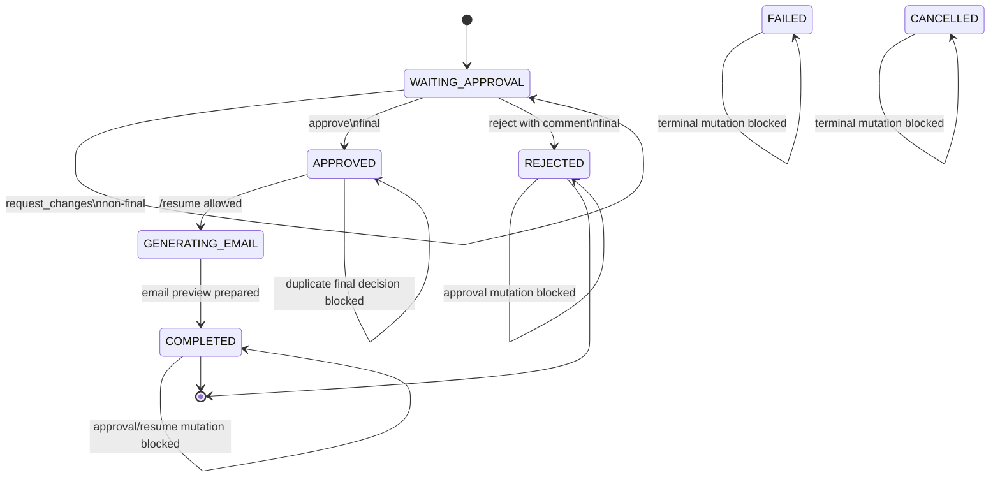

# Approval And Resume Lifecycle Diagram

This diagram shows approval decision semantics. Request changes is non-final
and leaves the workflow waiting. Approve and reject are final. Resume is only
allowed from `APPROVED` with a final approve record.

It matters for the report because it captures the lifecycle rules that protect
high-stakes procurement decisions and prevent duplicate or terminal-state
mutations.

Related docs: `.ai/specs/SPEC-012-human-approval-and-resume/spec.md`,
`docs/demo/DEMO_RUNBOOK.md`, and `docs/report/TECHNICAL_NARRATIVE.md`.
