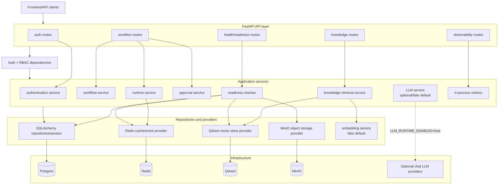

# Backend Layered Architecture Diagram

This diagram shows the backend separation of concerns. API routes validate HTTP
contracts and enforce auth/RBAC; services own workflow, approval, runtime,
knowledge, readiness, and metrics behavior; providers isolate infrastructure.

It matters for the report because it explains how business rules avoid leaking
into frontend code, provider clients, or route handlers.

Related docs: `.ai/project/ARCHITECTURE.md`,
`docs/report/ARCHITECTURE_AND_DESIGN.md`, and backend route/service specs.
