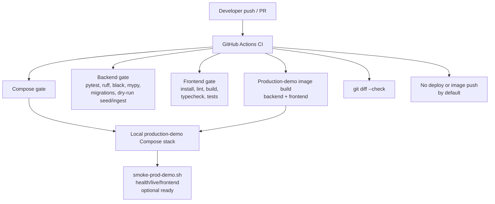

# CI And Deployment Flow Diagram

This diagram shows the quality and production-demo validation flow. CI and
local scripts validate Compose files, backend and frontend gates, production
image builds, and whitespace. The smoke script checks an already-running stack
by default.

It matters for the report because it demonstrates repeatable validation without
claiming real deployment, image registry publishing, cloud resources, or
Kubernetes/Terraform automation.

Related docs: `.github/workflows/ci.yml`, `scripts/README.md`,
`docs/deployment/SMOKE_CHECKS.md`, and
`.ai/specs/SPEC-014-production-deployment-observability/spec.md`.
