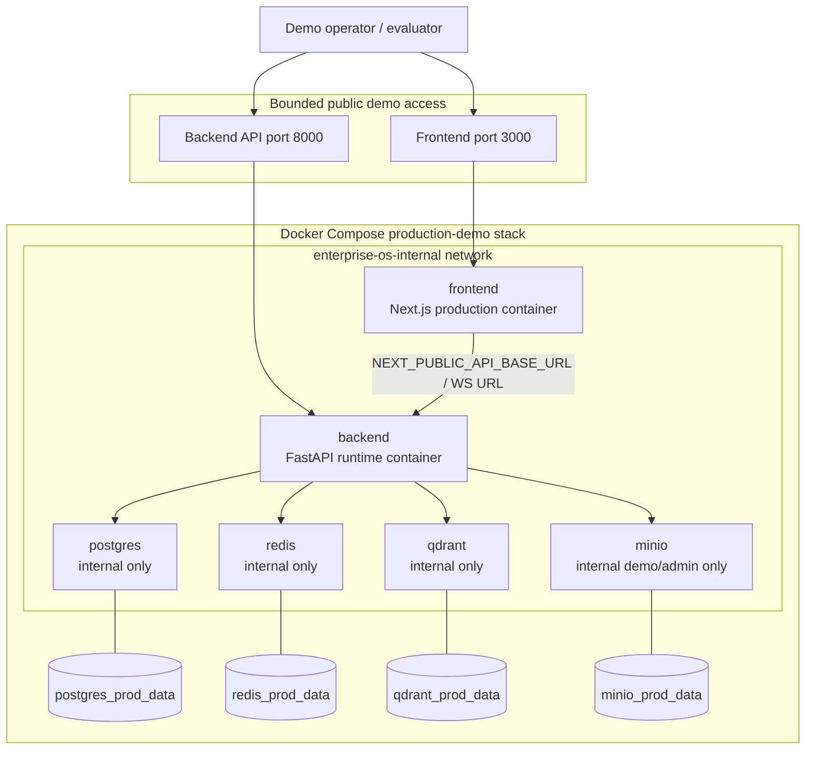

# Container Deployment Diagram

This diagram shows the implemented production-demo topology. The stack is a
single Docker Compose deployment with backend, frontend, and required
infrastructure services on an internal network. Persistent named volumes store
stateful service data.

It matters for the report because it shows a reproducible deployment path
without claiming cloud, Kubernetes, Terraform, autoscaling, or secret-vault
automation.

Related docs: `docker-compose.prod.yml`, `docs/deployment/RUNBOOK.md`,
`docs/deployment/ENVIRONMENT.md`, and `docs/deployment/SMOKE_CHECKS.md`.
