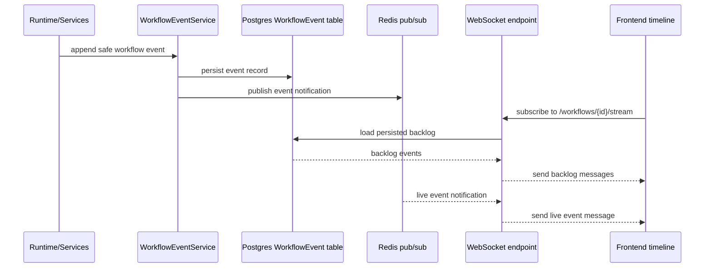

# Event Streaming Flow Diagram

This diagram shows how timeline evidence is produced. Runtime, approval,
resume, and RAG grounding behavior append persisted workflow events. The
frontend timeline receives both backlog events and live messages through the
existing WebSocket stream.

It matters for the report because it shows transparency without inventing a
second streaming mechanism or faking streamed events.

Related docs: `.ai/specs/SPEC-008-event-streaming/spec.md`,
`docs/demo/FRONTEND_SMOKE_FLOW.md`, and
`docs/final/E2E_DEMO_VALIDATION.md`.
