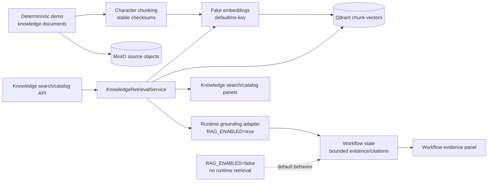

# RAG Knowledge Flow Diagram

This diagram shows the RAG path from deterministic demo documents through
chunking, fake embeddings, MinIO, Qdrant, retrieval, runtime grounding, and
frontend evidence views. Runtime grounding is optional and disabled by default.

It matters for the report because it explains how compliance, finance, and
approval stages can show citations without requiring live LLM keys or exposing
raw embeddings, vector payloads, prompts, or full documents.

Related docs: `.ai/specs/SPEC-013-rag-document-knowledge-base/spec.md`,
`docs/demo/DATASET_INVENTORY.md`, and
`docs/report/ARCHITECTURE_AND_DESIGN.md`.
