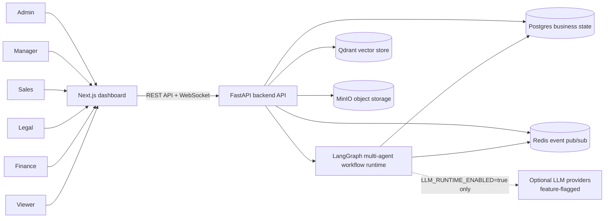

# System Context Diagram

This diagram shows the user-facing system boundary. Business users interact
through the Next.js dashboard, while the FastAPI backend remains the authority
for authentication, RBAC, workflow state, approval, retrieval, and operational
metrics.

It matters for the report because it distinguishes implemented infrastructure
from optional provider integrations. LLM provider calls are feature-flagged and
not required for deterministic no-key evaluation.

Related docs: `SPEC.md`, `docs/report/TECHNICAL_NARRATIVE.md`,
`docs/report/ARCHITECTURE_AND_DESIGN.md`, and
`.ai/specs/SPEC-011-llm-provider-abstraction/spec.md`.
