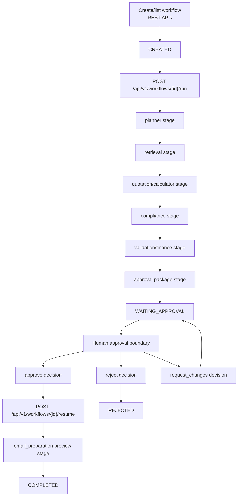

# Workflow Runtime Diagram

This diagram shows the implemented runtime flow. `/run` executes the
pre-approval stages and stops at `WAITING_APPROVAL`. Post-approval continuation
is explicit through `/resume`, which prepares an email preview and completes
the workflow.

It matters for the report because it demonstrates the human-in-the-loop safety
boundary and makes clear that `/run` does not auto-resume.

Related docs: `.ai/specs/SPEC-006-langgraph-runtime/spec.md`,
`.ai/specs/SPEC-012-human-approval-and-resume/spec.md`, and
`docs/final/E2E_DEMO_VALIDATION.md`.
